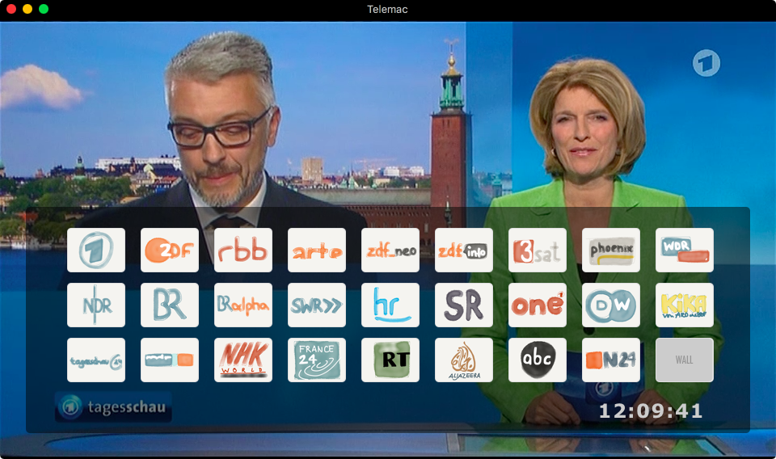
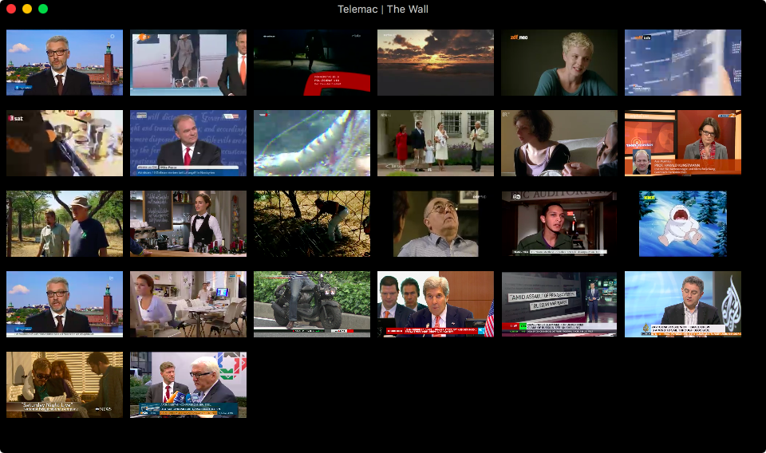

# Telemac

Willkommen bei Telemac. Eine Mac-App die zu Gunsten der Web-App [Teleweb](https://github.com/noestreich/Teleweb) nicht mehr weiterentwickeelt wird.
___

Dieses Projekt nutzt das [MacGap](https://github.com/MacGapProject/MacGap2)-Werkzeug um eine einfache, unter Zuhilfenahme von [video.js](http://videojs.com/) gestrickte Webseite als Mac-App anzubieten.
	
Telemac wurde vom [Telemat1000](https://github.com/noestreich/Telemat1000) inspiriert, ist nicht-kommerziell, setzt auf die frei verfügbaren Streams der Sender und sieht so aus.
#### Das Telemac-Hauptfenster:

#### Die Wall-Ansicht zeigt alle Sender gleichzeitig an:

___
## Neu in Version 2.4
- Sender-Streams aktualisiert (RBB, NHK und N24)
- App-Icon überarbeitet
- Kleinere UI-Anpassungen (Preloader)

## Neu in Version 2.3
- Testrelease für automatische Updates

## Neu in Version 2.2.5
- automatische Updates
- Styling
- Tastentöne beim Zappen abgeschaltet

## Neu in Version 2.2
- Auf [MacGap 2](https://github.com/MacGapProject/MacGap2) aktualisiert
- Nativer Vollbildmodus
- EPG-Button entfernt

## Neu in Version 2.0
- Senderwechsel mit "+" und "-" Tasten wird unterstützt.
- Senderlogos gegen selbstgezeichnete getauscht.
- Programm-Tasten werden nur noch bei Mausaktivität ein- und automatisch wieder ausgeblendet.
- Bessere Vollbildunterstützung. Leider mit macgap-bedingter, grauer Leiste oben im Bildschirm.
- ZDFkultur wurde (eingestellt und) aus Telemac entfernt. 
