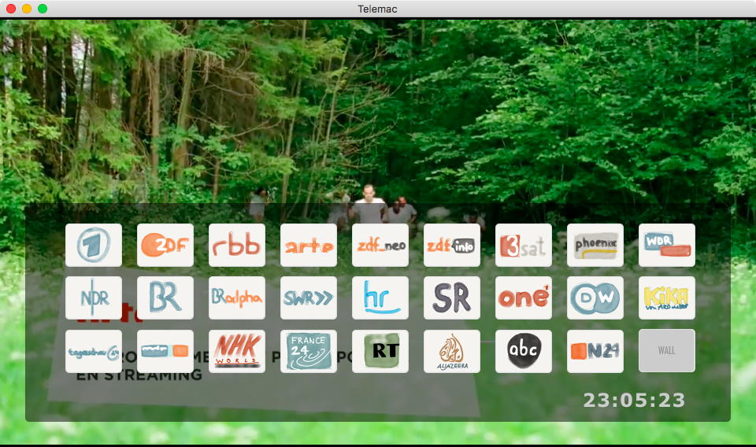
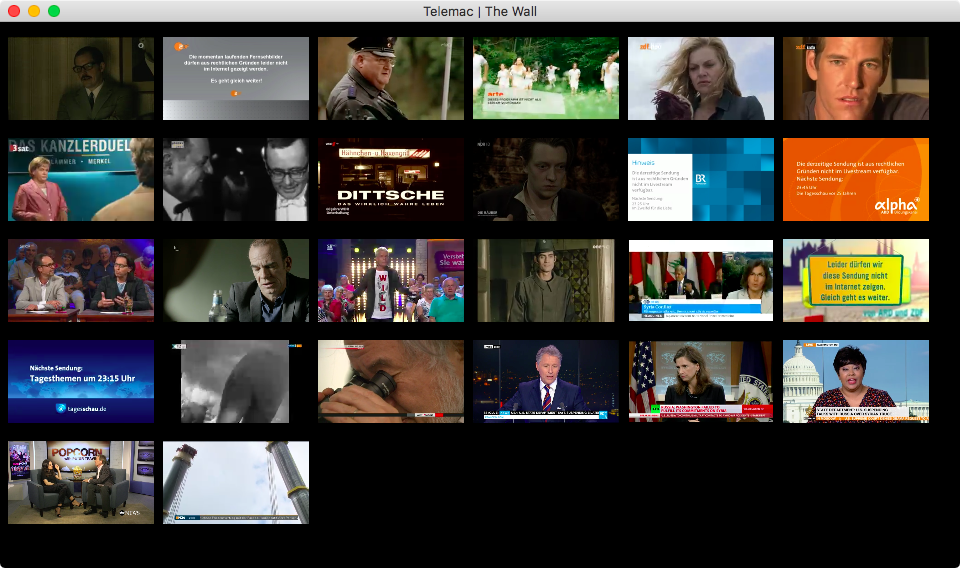

# Telemac

Willkommen bei Telemac 

Dieses Projekt nutzt das [MacGap](https://github.com/MacGapProject/MacGap2)-Werkzeug um eine einfache, unter Zuhilfenahme von [video.js](http://videojs.com/) gestrickte Webseite als Mac-App anzubieten.
	
Telemac wurde vom [Telemat1000](https://github.com/noestreich/Telemat1000) inspiriert, ist nicht-kommerziell, setzt auf die frei verfügbaren Streams der Sender und sieht so aus: 

###### Das Telemac-Hauptfenster.

Telemac kann in Version 2.2 [hier](https://github.com/noestreich/Telemac/releases) geladen werden.

## Neu in Version 2.2
- Auf [MacGap 2](https://github.com/MacGapProject/MacGap2) aktualisiert
- Nativer Vollbildmodus
- EPG-Button entfernt

## Neu in Version 2.0
- Senderwechsel mit "+" und "-" Tasten wird unterstützt.
- Senderlogos gegen selbstgezeichnete getauscht.
- Programm-Tasten werden nur noch bei Mausaktivität ein- und automatisch wieder ausgeblendet.
- Bessere Vollbildunterstützung. Leider mit macgap-bedingter, grauer Leiste oben im Bildschirm.
- ZDFkultur wurde (eingestellt und) aus Telemac entfernt. 

###### Die Wall-Anzeige der Telemac-Applikation zeigt alle Sender gleichzeitig an.